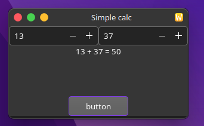

# gtk-glade-test



Build with CLANG (***recommended***):
```bash
export CC=clang && export CXX=clang++ && cmake -S . -B build && cmake --build build
```

Build with GCC:
```bash
export CC=gcc && export CXX=g++ && cmake -S . -B build && cmake --build build
```

Clean build:
```bash
rm -r build bin
```

Run:
```bash
./bin/gtk-glade-test
```
